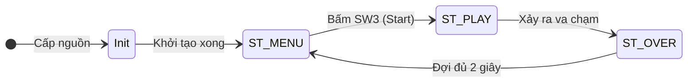
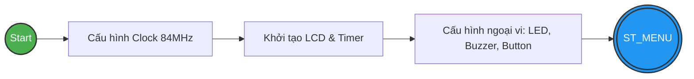
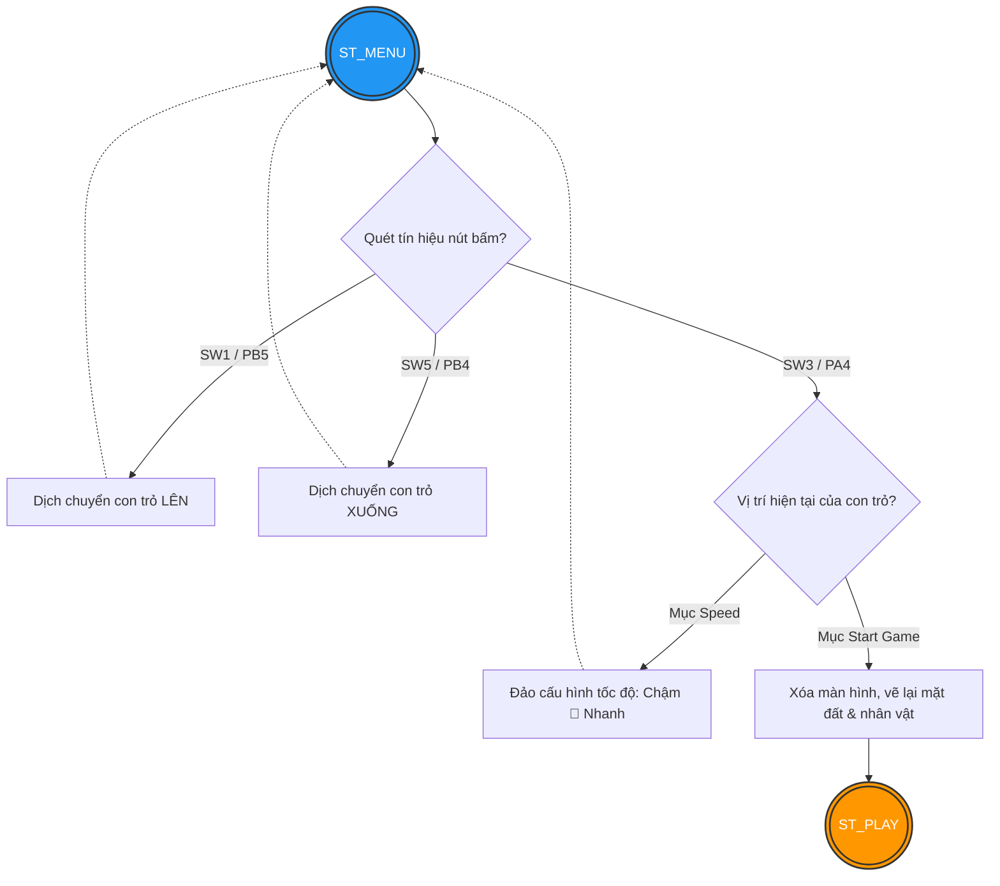
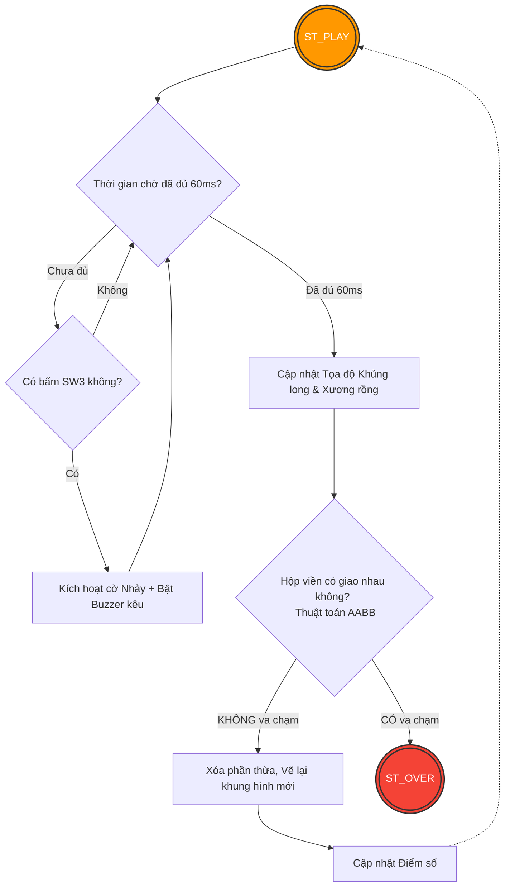
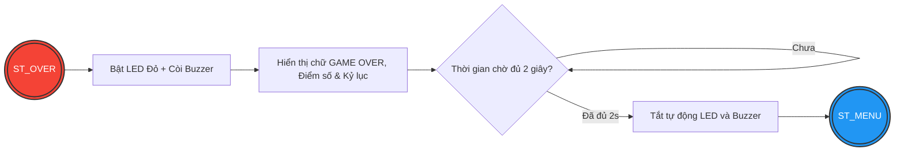

# 🦖 STM32-ChromeDino: Embedded Bare-Metal Project

Dự án phát triển và mô phỏng lại trò chơi giải trí nổi tiếng **Chrome Dinosaur (T-Rex Run)** hoạt động trong môi trường hệ thống nhúng Bare-metal (không sử dụng hệ điều hành). Chương trình được tối ưu hóa riêng cho vi điều khiển lõi ARM Cortex-M4 kết hợp hệ sinh thái phần cứng Lumi.

**Nhóm phát triển (Team 1):** Tống Tâm Ngọc &  Trần Huy Sơn.

---

## 🛠️ Thông Số Hệ Thống & Sơ Đồ Chân (Hardware Layout)

Hệ thống cấu thành từ board mạch nền tảng kết hợp bo mở rộng thông qua các đường bus ngoại vi tiêu chuẩn:
* **MCU:** STMicroelectronics NUCLEO-F401RE.
* **Shield mở rộng:** LUMI IoT STM Board Kit (Phiên bản LM-ISBK V1.0).

### Bảng tra cứu ánh xạ ngoại vi (Pin Mapping)

| Thiết bị ngoại vi | Mã hiệu linh kiện | Chân kết nối (STM32) | Giao tiếp / Vai trò kỹ thuật |
| :--- | :--- | :--- | :--- |
| **Màn hình Đồ họa** | ST7735 LCD (128x128) | SPI Pins | Hiển thị ma trận điểm, màu sắc |
| **Còi phản hồi** | Active Buzzer | `PC9` (via Transistor) | Phát tín hiệu âm thanh tần số khi nhảy |
| **Hệ thống Đèn nền** | LED RGB | Transistor Driver | Nhấp nháy cảnh báo trạng thái Game Over |
| **Nút bấm 1 (SW1)** | Tactile Button | `PB5` | Di chuyển/Điều hướng Menu lên phía trên |
| **Nút bấm 3 (SW3)** | Tactile Button | `PA4` | Xác nhận Menu / Ra lệnh cho Khủng long nhảy |
| **Nút bấm 5 (SW5)** | Tactile Button | `PB4` | Di chuyển/Điều hướng Menu xuống phía dưới |

---

## 🧠 Giải Thuật Hệ Thống & Tư Duy Thiết Kế (System Architecture)

Dự án áp dụng nhiều kỹ thuật lập trình tối ưu hóa bộ nhớ và tăng tốc xử lý cho vi điều khiển:

### 1. Kiến trúc Máy trạng thái (Finite State Machine - FSM)
Vòng đời vận hành của chương trình được quản lý tập trung qua biến trạng thái toàn cục với 3 phân vùng độc lập:
* `ST_MENU`: Giao diện tương tác ban đầu. Cho phép xem điểm kỷ lục (`Best Score`) và cấu hình vận tốc trò chơi.
* `ST_PLAY`: Vòng lặp gameplay cốt lõi. Tính toán vị trí, bắt sự kiện và cập nhật đồ họa hiển thị.
* `ST_OVER`: Trạng thái dừng hệ thống khi xảy ra va chạm. Kích hoạt chuỗi cảnh báo LED/Buzzer trong 2 giây trước khi tự động khởi động lại Menu.

### 2. Quản lý Đồ họa & Khung hình
* **Đồng bộ khung thời gian (Non-blocking FPS Control):** Thay vì dùng hàm khóa luồng (`delay`), hệ thống áp dụng cơ chế kiểm tra sai lệch thời gian thực qua hàm đếm Tick với chu kỳ cố định `60ms/frame` (~16.6 FPS).
* **Vẽ cục bộ chống nhấp nháy (Partial Refresh):** Để giải quyết giới hạn tốc độ truyền của bus SPI khi kéo màn hình màu, thuật toán chỉ thực hiện xóa và vẽ lại các pixel có sự thay đổi tọa độ (giữa vị trí cũ và mới). Phương pháp này giúp triệt tiêu hoàn toàn hiện tượng sụt khung hình hoặc chớp nháy LCD.

### 3. Vật lý & Thuật toán va chạm
* **Cơ chế nhảy đơn giản:** Quỹ đạo bay được mô phỏng tuyến tính gói gọn trong 14 frame (7 frame gia tốc đi lên, 7 frame giảm tốc đi xuống) với biên độ trần đạt 35 pixel.
* **Phát hiện va chạm hình học (AABB):** Áp dụng mô hình toán học *Axis-Aligned Bounding Box*. Hệ thống liên tục thực hiện so sánh 4 đường biên tọa độ của hai hình chữ nhật bao quanh Khủng long và Xương rồng, giúp phát hiện va chạm tức thì với chi phí tính toán cực thấp.
* **Xoay vòng chướng ngại vật:** Tích hợp 3 hình dáng xương rồng khác nhau, được thay đổi luân phiên ngẫu nhiên dựa trên giá trị thời gian thực tại thời điểm chướng ngại vật cũ đi hết màn hình.

---

## 🔄 Lưu Đồ Thuật Toán Hệ Thống (System Flowcharts)

Hệ thống được thiết kế theo kiến trúc **Máy trạng thái hữu hạn (FSM)**. Dưới đây là sơ đồ luân chuyển tổng quan và luồng xử lý chi tiết của từng trạng thái.

### 1. Sơ đồ trạng thái tổng quan (Main State Machine)

### 2. Giai đoạn Khởi tạo (Initialization)

### 3. Trạng thái ST_MENU (Giao diện chờ)

### 4. Trạng thái ST_PLAY (Vòng lặp Game chính)

### 5. Trạng thái ST_OVER (Kết thúc lượt chơi)


## 📂 Cấu Trúc Mã Nguồn (Repository Directory)

Dự án được phân tách cấu trúc rõ ràng theo chuẩn STM32CubeIDE nhằm đảm bảo tính module hóa:

```text
├── Core/
│   ├── Inc/                    # Thư mục chứa các file tiêu đề (.h)
│   └── Src/
│       ├── main.c              # Xử lý logic vòng lặp game và máy trạng thái
│       ├── syscalls.c          # Các hàm stub hệ thống mức thấp của GCC
│       └── sysmem.c            # Quản lý phân vùng bộ nhớ động Heap cho Newlib
├── Startup/                    # Mã nguồn khởi động và Vector ngắt (.s)
├── LinkerScripts/              # File phân bổ vùng nhớ Flash/RAM (.ld)
├── SDK_1.0.3_NUCLEO-F401RE/    # Bộ thư viện chuẩn của ST và mở rộng của Lumi
└── README.md                   # Tài liệu hướng dẫn hệ thống
```
## Tổng quan

Người chơi có thể chọn độ khó trên màn hình menu khi mở game. Sau khi bắt đầu, người chơi điều khiển khủng long với mục tiêu nhảy qua càng nhiều xương rồng càng tốt. Game sẽ theo dõi điểm số và hiển thị trên menu. Khi thua, người chơi sẽ được hiển thị điểm hiện tại và điểm cao nhất, sau đó quay về menu.

## Yêu cầu phần mềm

- [STM32CubeIDE](https://www.st.com/en/development-tools/stm32cubeide.html)
- [LUMI SDK](https://github.com/HD-Nam/ThuVien_SDK_1.0.3_NUCLEO-F401RE) đã clone về máy

## Chi tiết kỹ thuật

- **Tốc độ khung hình:** Cố định 60ms/frame (khoảng 16 FPS) cho mọi mức tốc độ
- **Tốc độ xương rồng:** Chậm = 6 pixel/frame, Nhanh = 9 pixel/frame
- **Nhảy:** 14 frame (7 frame bay lên + 7 frame rơi xuống), độ cao 35 pixel
- **Va chạm:** Sử dụng thuật toán AABB (Axis-Aligned Bounding Box)
- **3 loại xương rồng:** Xoay vòng ngẫu nhiên mỗi lần xuất hiện lại
